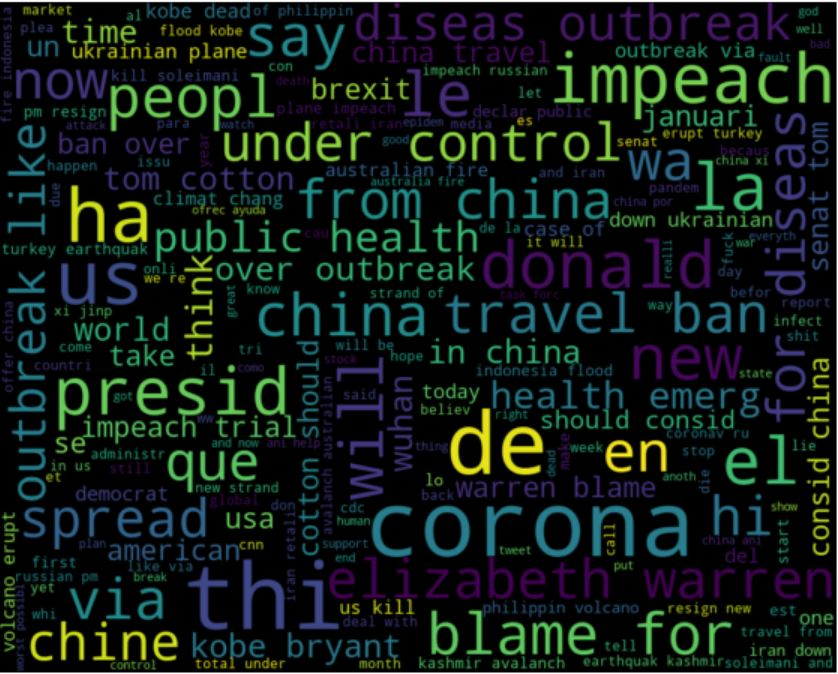
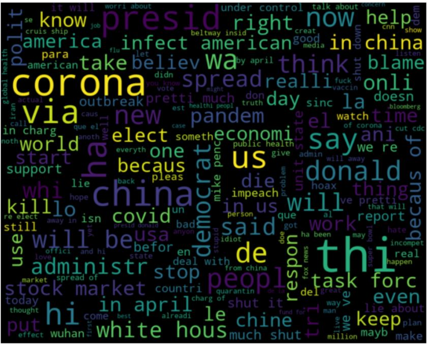
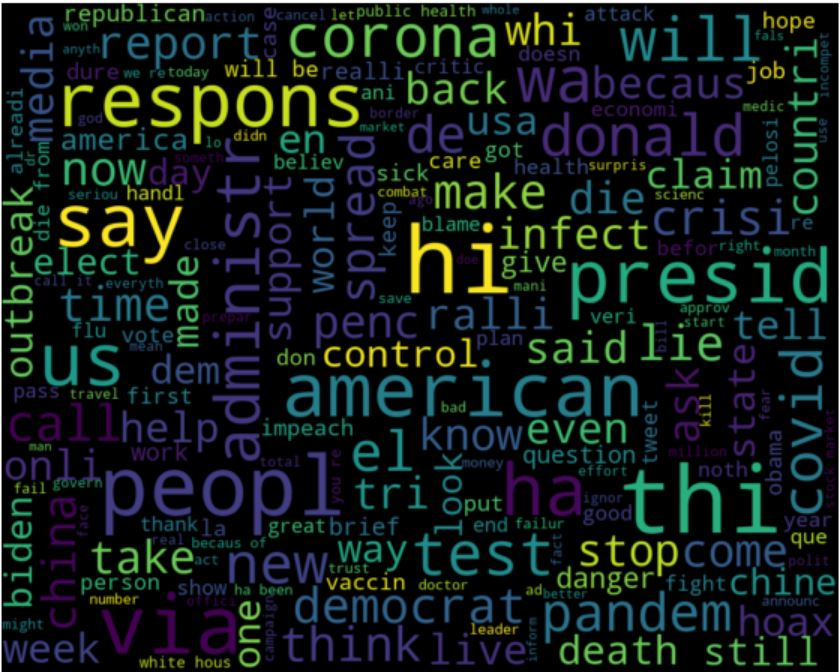
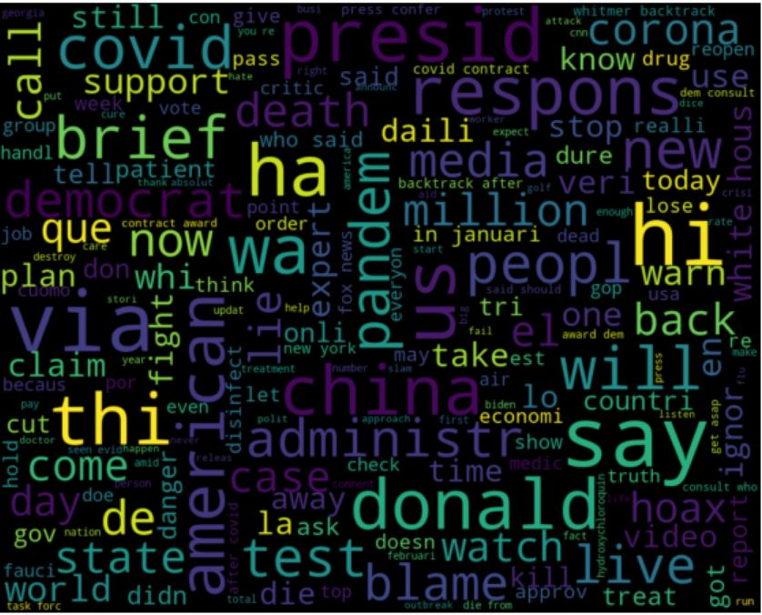
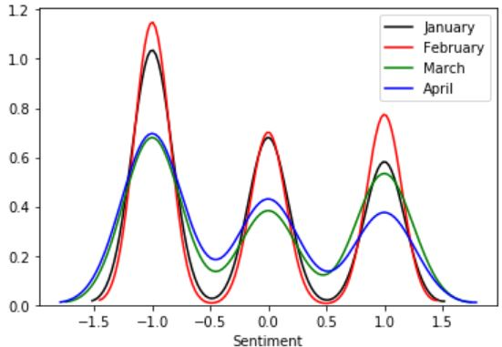

# Covid-19-and-Trump: An exploratory analysis on the public's opinion towards COVID-19 and President Trump, using data from Twitter.

## Table of Contents
* [Introduction](#introduction)
* [Background](#background)
* [Findings](#findings)
* [Limitations](#limitations)
* [Usage](#usage)

## Introduction

The motivation for this project came from [this](https://towardsdatascience.com/understanding-political-twitter-ce3476a38377) article. I found the results of their analyses to be very interesting and realized the potential of drawing wonderful insights from Twitter data using **Natural Language Processing** and more specifically **Sentiment Analysis.** It is worth mentioning that this project serves as an introduction to NLP for myself, therefore, it is merely exploratory.

## Background

In recent months, we have witnessed the spread of the novel Coronavirus and it's consequences on the routinely lives of people across the world. With travel restrictions, a surge in unemployment rates, and an overburden on hospitals, people looked to their leaders and governments in hopes of handling the unprecedented situation as best as possible. Although, the primary response of most countries has been to implement "social-distancing" and "stay-at-home" policies, President Trump's government has had several stances on dealing with the spread of the virus. In addition, the public's attitude towards the virus as well as the President's response to it, appears to be quite diverse.

Using the [twitterscraper](https://github.com/taspinar/twitterscraper) module, I collected data from Twitter, with tweets consisting of the keywords: "coronavirus & trump," and time period: Jan-1-2020 to May-1-2020. My aim was to address the following questions:

- Besides the keywords, what are other words that are most frequently found in these tweets?
- How has the overall sentiment (regarding coronavirus & trump) changed over time?

For sentiment analysis, I used the [Vader](https://github.com/cjhutto/vaderSentiment) Sentiment Analysis tools.

## Findings

A major proportion of the tweets found were from the twitter account: https://twitter.com/bitcoinconnect?lang=en. In order to avoid biases in the results, I removed all tweets from this account. The pre-processing steps taken can be seen in the notebook. After cleaning the data and filtering out keywords/stop words from the tweets, the following wordclouds were generated for: tweets from January, February, March, and April, respectively:

          
          

Keeping in mind that all these tweets consist of the keywords "coronavirus" and "trump," here are some interesting observations:
- "Under control" pops up in January's wordcloud.
- "Blame" consistently appears as a common word, along with "Hoax" and "Democrat."
- "Elizabeth Warren" and "Biden" appear as common words.

These tweets could further be analyzed, clustered, and mined for frequent patterns, and correlation analyses, however due to the limitations, I decided to keep it at a basic exploratory level.

The following plot shows how the sentiment of the tweets varied from January through April:

The first case of coronavirus in the US came sometime in late January. It appears, from the plot, that January and February were the months with the most negative tweets. However, February was also the month with the most positive tweets.

## Limitations

Although the twitterscraper module allows us to scrape as many tweets as we want, it is limited by the internet speed/bandwidth, therefore, the number of tweets scraped is different each time. In addition, the number of tweets scraped for each month also varies, which directly affects our results. Due to these issues, I have not made any inferences/conclusions from the results, especially since the purpose of this project was merely for learning.

## Usage

The project may be best viewed in a notebook viewer that can be accessed [here](). In this notebook, you will find a walk through of the work done and the respective code.
